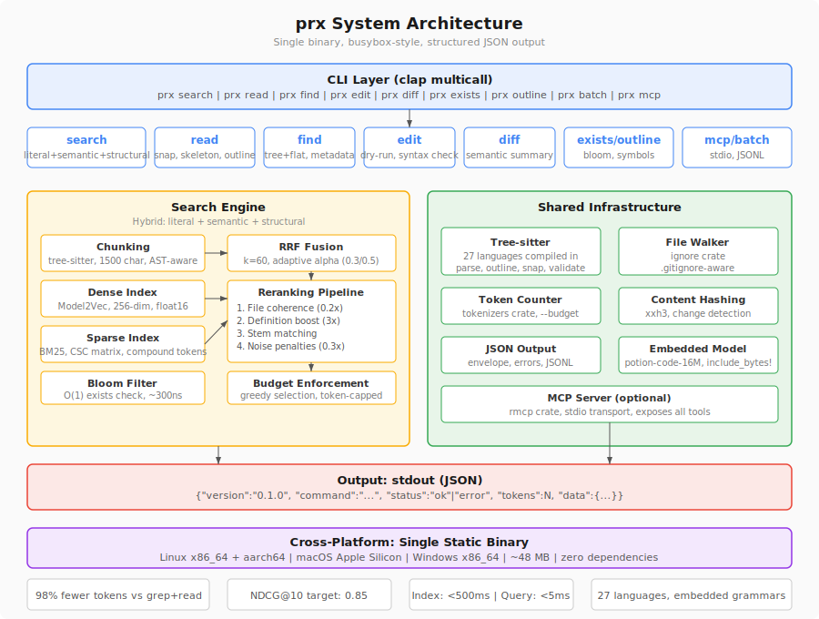

# System Overview

prx is a single Rust binary with a busybox-style architecture. Every subcommand shares common infrastructure — tree-sitter parsing, token counting, JSON output, content hashing — but each command is a self-contained module. The binary can be invoked as `prx <subcommand>` or via hardlinks named after each subcommand.



## Binary Architecture

prx uses `clap::Command::multicall(true)` to dispatch subcommands. This means the same binary can be invoked as `prx search` or as a hardlink named `prx-search` — both routes hit the same handler.

Subcommand dispatch goes through a Rust enum:

```rust
enum Commands {
    Search(SearchArgs),
    Read(ReadArgs),
    Find(FindArgs),
    Edit(EditArgs),
    Diff(DiffArgs),
    // ...
}
```

Each command lives in `src/commands/` as its own module. Shared infrastructure lives in the `src/` root modules, imported by any command that needs it.

## Module Layout

```
src/
├── main.rs              # CLI entry point, clap dispatch
├── lib.rs               # Library surface (public API)
├── output.rs            # JSON envelope, error formatting
├── tokens.rs            # Token counting (tokenizers crate)
├── hash.rs              # Content hashing (xxh3)
├── walk.rs              # File walking (ignore crate)
├── workspace.rs         # Shared utilities
├── fallback.rs          # Graceful fallback to Unix tools
│
├── commands/            # Subcommand handlers
│   ├── search.rs        # prx search
│   ├── read.rs          # prx read
│   ├── find.rs          # prx find
│   ├── edit.rs          # prx edit
│   ├── diff.rs          # prx diff
│   ├── batch.rs         # prx batch
│   ├── context.rs       # prx context
│   ├── impact.rs        # prx impact
│   ├── index.rs         # prx index
│   ├── init.rs          # prx init
│   ├── mcp.rs           # prx mcp
│   ├── outline.rs       # prx outline
│   ├── exists.rs        # prx exists
│   ├── stats.rs         # prx stats
│   └── run.rs           # prx run
│
├── search/              # Search engine
│   ├── fusion.rs        # RRF fusion, adaptive alpha
│   ├── graph.rs         # Import graph
│   ├── semantic.rs      # Model2Vec embedding search
│   ├── literal.rs       # Regex/literal search
│   ├── structural.rs    # ast-grep pattern search
│   ├── tokenize.rs      # Identifier tokenization
│   └── symbols.rs       # Symbol index
│
├── chunking/            # Code chunking
│   └── treesitter.rs    # Tree-sitter AST chunking
│
├── ranking/             # Result ranking
│   ├── boosting.rs      # Definition boost, stem matching, coherence
│   ├── penalties.rs     # Noise penalties, saturation decay
│   ├── proximity.rs     # Import graph proximity boost
│   └── weighting.rs     # Alpha weight resolution
│
├── index/               # Index management
│   ├── dense.rs         # Model2Vec embeddings
│   ├── sparse.rs        # BM25 sparse matrix
│   └── bloom.rs         # Bloom filter for exists
│
├── parsing/             # Tree-sitter integration
│   ├── imports.rs       # Import extraction (20 language families)
│   ├── languages.rs     # Language detection, grammar loading
│   ├── outline.rs       # Symbol extraction
│   ├── snap.rs          # Structural snapping
│   └── strip.rs         # Comment stripping
│
└── runner/              # prx run parsers
    ├── mod.rs           # Runner framework, tool detection
    ├── cargo_test.rs
    ├── pytest.rs
    ├── go_test.rs
    └── ...              # 22 parsers total
```

## Shared Infrastructure

### Tree-sitter Parsing (`src/parsing/`)

AST parsing for 27 languages, with grammars compiled directly into the binary. No runtime grammar loading. Tree-sitter powers chunking, `--snap`, `--skeleton`, `--outline`, syntax validation, structural search, and import extraction. Language grammars are C code compiled via the `cc` crate at build time.

### Token Counting (`src/tokens.rs`)

Two modes: fast (`byte_count / 4`) for general use, and exact (cl100k_base tokenizer) when `--budget` is active. The tokenizer vocabulary is embedded via `include_bytes!` and loaded lazily on first use. Commands select results greedily until the token budget is exhausted.

### JSON Output (`src/output.rs`)

Every command returns a standardized JSON envelope. Errors go to stdout as structured JSON — never to stderr. The `--plain` flag bypasses the envelope for human-readable output. Command handlers never write to stdout directly; all output goes through this module.

### Content Hashing (`src/hash.rs`)

xxh3 128-bit hashing via the `xxhash-rust` crate. Runs at ~30 GB/s, making it cheaper to recompute than to cache. Every response that includes file content includes a hash, enabling agents to skip re-reads when nothing has changed.

### File Walking (`src/walk.rs`)

Built on the `ignore` crate (from ripgrep). Respects `.gitignore` and `.prxignore`. Skips binary files (null byte in first 8KB) and files over 1MB. Used by search, find, and index commands.

## Data Flow

A typical search query follows this path:

1. CLI parses args, dispatches to `Commands::Search`
2. File walker discovers files, respecting `.gitignore`
3. Tree-sitter chunks each file (1500-char, syntax-aware boundaries)
4. If semantic mode: embed chunks via Model2Vec (lookup + mean pool + normalize)
5. If semantic mode: embed query, run cosine similarity against chunk vectors
6. If literal mode: regex match against chunk text
7. BM25 scores computed (if hybrid or sparse mode)
8. RRF fusion combines scores from active retrievers
9. Reranking pipeline applies boosts and penalties
10. Budget enforcement selects top results greedily until token limit is reached
11. Results serialized as JSON and written to stdout

## Import Graph and Project Intelligence

The import graph (`search/graph.rs`) captures file-level dependency edges extracted via tree-sitter AST queries across 20 language families. Edges are resolved by suffix matching with proximity-based disambiguation. The graph is persisted as `imports.bin`.

Two commands consume the import graph:

- **`prx context`** assembles a module context package: stats, documentation, entrypoints, file skeletons, and 1-hop import edges.
- **`prx impact`** walks the import graph backwards to find dependents. Supports symbol-level narrowing.

Both commands work without a persisted index, building the graph on-the-fly with a warning.

## MCP Server (`src/commands/mcp.rs`)

Compiled in by default (controlled by the `mcp` Cargo feature). Exposes all prx tools as MCP tools over stdio transport using the `rmcp` crate. Async runtime via `tokio`, linked only when the `mcp` feature is active. The core binary without `mcp` or `watch` is fully synchronous.

## Feature Flags

| Feature | Dependencies | Purpose |
|---------|-------------|---------|
| `default` | `["mcp"]` | Includes MCP server by default |
| `mcp` | `rmcp`, `tokio` | MCP stdio server |
| `watch` | `notify`, `tokio` | File watching for persistent index |

## Key Architectural Decisions

These decisions are settled. They reflect deliberate tradeoffs, not defaults.

| # | Decision | Rationale |
|---|---|---|
| 1 | **Single binary, busybox-style** | clap multicall. `prx search` or hardlink `prx-search`. Zero install friction — download one file, run it. |
| 2 | **Model weights embedded in binary** | `include_bytes!` with float16 potion-retrieval-32M model (~32 MB). No internet required, works in sandboxes and air-gapped environments. |
| 3 | **Pure Rust Model2Vec inference** | No ONNX Runtime dependency. Inference is tokenize + lookup + mean pool + normalize (~50 lines). ONNX Runtime dropped x86_64 macOS support; pure Rust works everywhere. |
| 4 | **JSON output by default** | Agents parse structured data, not column-aligned text. `--plain` flag for human fallback. Errors in stdout, never stderr. |
| 5 | **Tree-sitter for structural code parsing** | Powers chunking, --snap, --skeleton, --outline, syntax validation, structural search. Import extraction uses tree-sitter AST queries (20 language families). No LSP server required. |
| 6 | **Token budgets, not truncation** | `--budget N` returns the best N tokens of results, ranked by relevance. Not `head -N` arbitrary cutoff. |
| 7 | **Dry-run edits by default** | `prx edit` previews changes. `--apply` commits. Agents see what will change before it happens. |
| 8 | **Content hashes in every response** | Enables cheap "has this changed?" checks. Eliminates ~50% of redundant file re-reads. |
| 9 | **No daemon for basic usage** | All commands work statelessly. Optional `prx index --watch` for warm caching. |
| 10 | **6-stage reranking pipeline** | Definition boost, stem matching, file coherence, import graph proximity, noise penalties, saturation decay. Quality comes from ranking, not just retrieval. |
| 11 | **BM25 with compound identifier tokenization** | camelCase/snake_case splitting without stemming. Code identifiers are semantically distinct — "HTTPResponse" and "HTTP" mean different things. |
| 12 | **RRF fusion with adaptive alpha** | Symbol queries (Foo::bar) lean BM25 (alpha=0.3). Natural language queries stay balanced (alpha=0.5). Auto-detected. |
| 13 | **Parallel indexing via rayon** | All 5 indexing stages run in parallel. No shared mutable state, no Arc, no Mutex — pure `par_iter` on thread-safe immutable data. v0.5.5: 7.6x speedup (410s → 54s). v0.5.14: embedding computation parallelized within stages + O(n²) hot-path fixes → 2.2x additional speedup (54s → 24s). ~17x total on 10-core. |
| 14 | **Zero-copy memory-mapped embeddings** | `embeddings.bin` is mmap'd via `memmap2` and cast to `&[f32]` with `bytemuck::cast_slice` (zero allocation, zero deserialization). OS page cache keeps index warm across queries. Falls back to owned `Array2<f32>` if mmap fails. |

## Error Handling

All errors are written to stdout as structured JSON:

```json
{
  "version": "0.2.0",
  "command": "read",
  "status": "error",
  "error": {
    "code": "file_not_found",
    "message": "File not found: src/auth.ts",
    "suggestion": "Use `prx find` to discover files."
  }
}
```

stderr is reserved for `RUST_LOG` debug logging only. Exit codes: `0` for success, `1` for errors, `2` for usage errors.

When prx fails internally, the [fallback system](fallback.md) catches the error, runs the equivalent Unix tool, and returns results in the same JSON envelope with `"fallback": true`.
